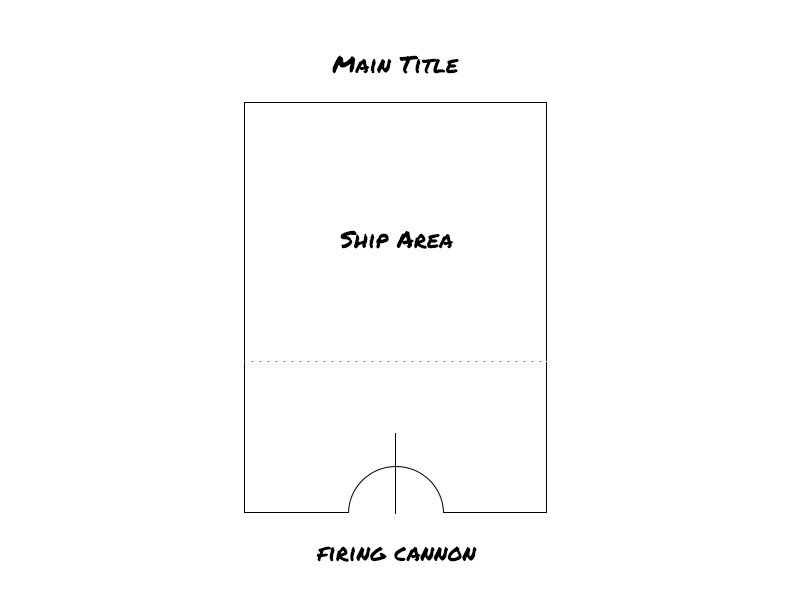

## Variation of 10 Bullets

### Background

This is a varation of the game '10 Bullets'

[Original 10 Bullets game][site]

[site]: http://www.kongregate.com/games/sushistory/10-bullets

In the game 10 bullets, the player starts out with 10 bullets and has the goal of using them to hit as many ships as possible. Ships fly across the screen horizontally and the player fires at them from the bottom center of the screen. When a ship is hit, it sends out additional projectiles that can then hit other ships, which send out projectiles that hit other ships, creating chain reactions.

This variation will incorporate the following changes, as compared to the original game:

1) Instead of a single level with infinite ships, the game will consist of multiple levels, each with a set amount of objects to destroy.
2) Instead of objects moving horizontally across the screen, each level will have multiple objects moving in all directions within a defined area.
3) Instead of only being able to shoot vertically, the player will be able to shoot in a 180 degree arc.

This variation of the game will include various additional features, as outlined in the **Functionality & MVP** and **Bonus Features** sections.

### Functionality & MVP  

With this variation of 10 Bullets, users will be able to:

- [ ] Start, pause, and reset the game
- [ ] Rotate the firing 'cannon' in a 180 degree arc and fire projectiles at the moving objects
- [ ] Continue to the next level when all of that level's objects are destroyed.
- [ ] Keep track of their score
- [ ] Restart the game after they have run out of projectiles

In addition, this project will include:

- [ ] An About modal describing the rules of the game
- [ ] A production Readme

### Wireframe

This app will consist of a single screen with the game view, information about keybindings for game controls, and nav links to the Github, my LinkedIn, and the About modal. Game controls will include Start, Pause, and Restart, as well moving the firing 'cannon' left and right and firing.

### Architecture and Technologies

This project will be implemented with the following technologies:

- Vanilla JavaScript and `jquery` for overall structure and game logic,
- `Easel.js` with `HTML5 Canvas` for DOM manipulation and rendering,
- Webpack to bundle and serve up the various scripts.

In addition to the webpack entry file, there will be three scripts involved in this project:

`game_view.js`: this script will handle the logic for creating and updating the necessary `Easel.js` elements and rendering them to the DOM.

`reactions.js`: this script will handle the logic behind the scenes. A Reaction object will hold an array of ships and an array of projectiles. It will be responsible for keeping track of their statuses.

`ship.js`: this script will house the constructor and update functions for the `Ship` objects. Each `Ship` will contain a radius as well as information about how it will behave when it is destroyed.

`projectile.js`: this script will house the constructor and update functions for the `Projectile` objects. Each `projectile` will have a position and a velocity.

`cannon.js`: this script will house the constructor and update functions for the `Cannon` object. The `cannon` will have a position and direction.

### Implementation Timeline

**Day 1**: Setup all necessary Node modules, including getting webpack up and running and `Easel.js` installed.  Create `webpack.config.js` as well as `package.json`.  Write a basic entry file and the bare bones of all 3 scripts outlined above.  Learn the basics of `Easel.js`.  Goals for the day:

- Get a green bundle with `webpack`
- Learn enough `Easel.js` to render an object to the `Canvas` element

**Day 2**: Dedicate this day to learning the `Easel.js` API.  First, build out the `Ship` object to connect to the `GameView` object.  Then, use `game_view.js` to create and render the game area. Add the ability to randomly generate a specific number of `Ship` objects in the view. Goals for the day:

- Complete the `ship.js` module
- Render a game area to the `Canvas` using `Easel.js`
- Create ships that move around within the confines of the game area

**Day 3**: Create the Cannon and Projectile elements. Create the reaction logic backend.  Build modular functions for how Ships behave when hit by a projectile.  Incorporate the reaction logic into the `GameView.js` rendering. Goals for the day:

- Create `Ship` and `Projectile` objects
- Export an `Reaction` object with correct handling logic
- Have a functional grid on the `Canvas` frontend that correctly handles the interactions of the ships, projectiles, and cannon.

**Day 4**: Install the controls for the user to interact with the game.  Style the frontend, making it polished and professional.  Goals for the day:

- Create controls for start, pause, reset, rotate cannon, and fire
- Have a styled `Canvas`, nice looking controls and title
- If time: include bonus features

### Bonus features

There are a number of additional features that I could add to the game, some of them are:

- [ ] Add additional difficulty to higher levels, such as ships with different properties (eg: requiring more than one projectile to destroy, increased speed, etc...)
- [ ] Add powerups, such as extra bullets or causing explosions to release additional projectiles
- [ ] Continue to improve the game appearance.
